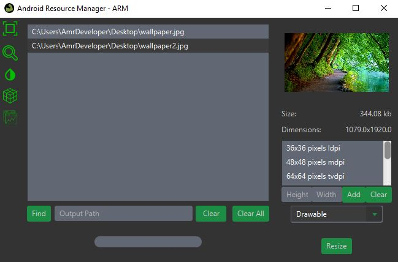
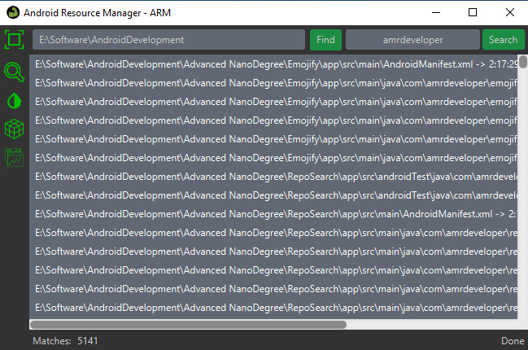
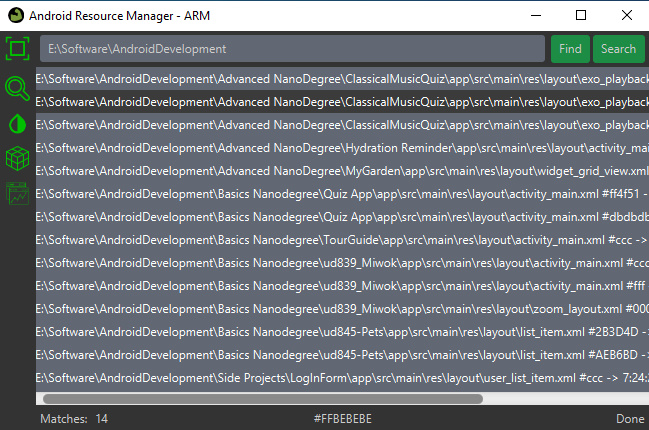
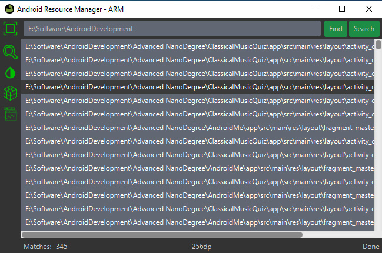
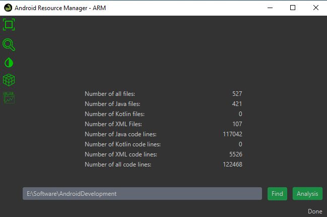

# AndroidResourceManager

Cross-Platform tools to manage your resources as an Android Developer, AndroidResourceManager - ARM provide five main services to you

### Image Resize Service
You can easily resize your drawable, mipmap or normal images with unlimited number of sizes, the default sizes are 7 which are ldpi, mdpi, tvdpi,
hdpi, xhdpi, xxhdpi, xxxhdpi and you can add or remove sizes and preview your image.

### Keyword Search Service

Once you select your project directory and put your search keyword, the ARM will search in all your Java, Kotlin, C++, Xml and normal text files for this keyword
and show you the details of the search, file name, start and end position.

### Color Analysis Service
Once you select your project directory and click on search, 
ARM will search for every hex color value in your layout resources and show it to you so you should put them in color.xml and clear your resources

### Dimensions Analysis Service
Once you select your project directory and click on search, ARM will search for every dimension value in your layout resources and show it to you so you should put them in dimens.xml and clear your resources

### Source Code Analysis Service
Once you select your project directory and click analysis, the ARM will be analysing your source code files and show you the number of Java, Kotlin and XML files.

Feel free to suggest, submit an issue or create a pull request

Youtube Video: [AndroidResourceManager 1.0.0](https://www.youtube.com/watch?v=sEdpBIALJIg&feature=youtu.be&ab_channel=AmrDeveloper)
